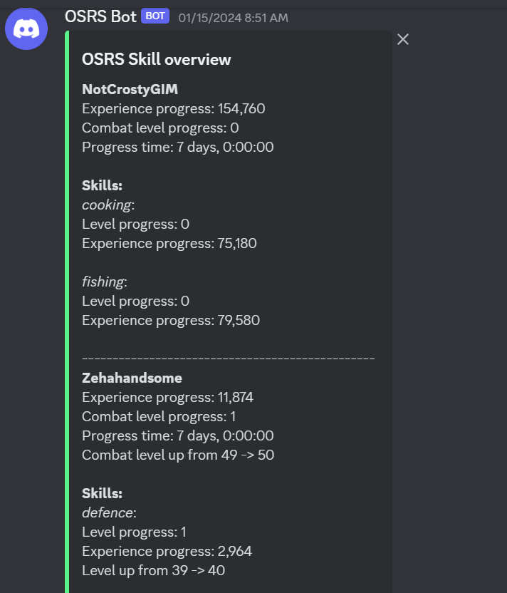

# Fetch Hiscores from Old School Runescape

Easily fetch your OSRS user hiscores with the following:

```python
from src.api.osrs.hiscores import Hiscores

user = Hiscores("Zehahandsome")
print(user.character)
```

## Discord Webhook

This repo also provides a Discord webhook that uses AWS Cloud in the
background to log and report progress to a desired Discord channel:



To setup Discord webhook, defined a `setup.tfvars` file in the `terraform/` folder. The content
of the `.tfvars` file should look something similar to:

```yaml
osrs_usernames = ["osrs_user1", "osrs_user2"]
osrs_remote_folder = "hiscores"
discord_webhook_url = "https://discordapp.com/api/webhooks/123456789/blabla-f456ds-this-is-a-fake-url"
```

Note: To get the Discord Webhook URL look in `Discord > Server Settings > APPS > Integrations > Webhooks` 

From the repository root, run:

```bash
make setup-discord-webhook-infra
```

To destroy all the created resources again, run:

```bash
make destroy-discord-webhook-infra
```

## Tests

To run tests in this repository, follow these steps:

1. Make sure you have the necessary environment variables set up. These variables are required for the tests to run successfully.

    ```yaml
    DISCORD_WEBHOOK=...
    AWS_ACCESS_KEY_ID=...
    AWS_SECRET_ACCESS_KEY=...
    ```

2. Run the test command in your terminal or command prompt:

   ```bash
   make test-unit
   ```

   This run all the unit tests in the `tests` directory. To run all tests including the AWS tests, do

   ```bash
   make test-aws
   ```

   This requires all the enviroment variables to be set from step 1.

3. Check the test results in the terminal or command prompt. Any failures or errors will be displayed, allowing you to identify and fix any issues.

Note: If you encounter any issues related to environment variables, make sure they are correctly set up and accessible to the test environment.
